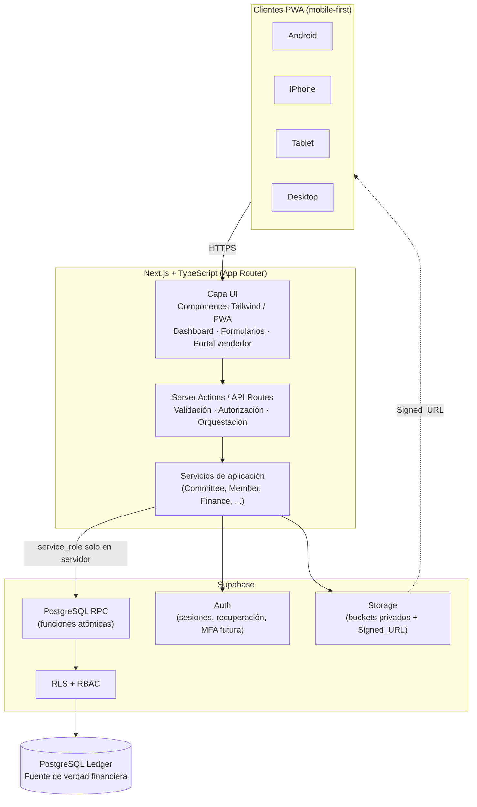
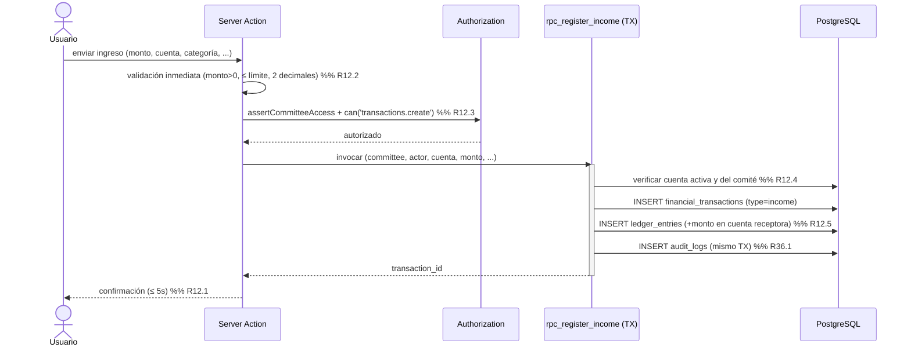
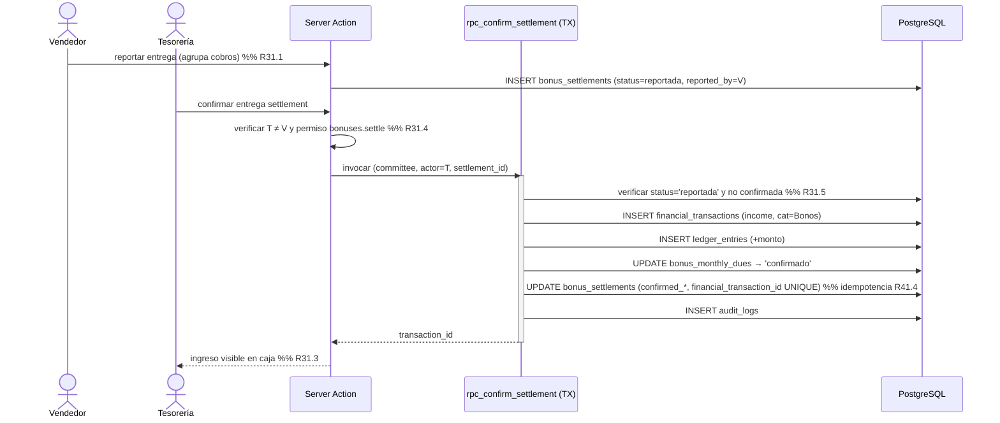
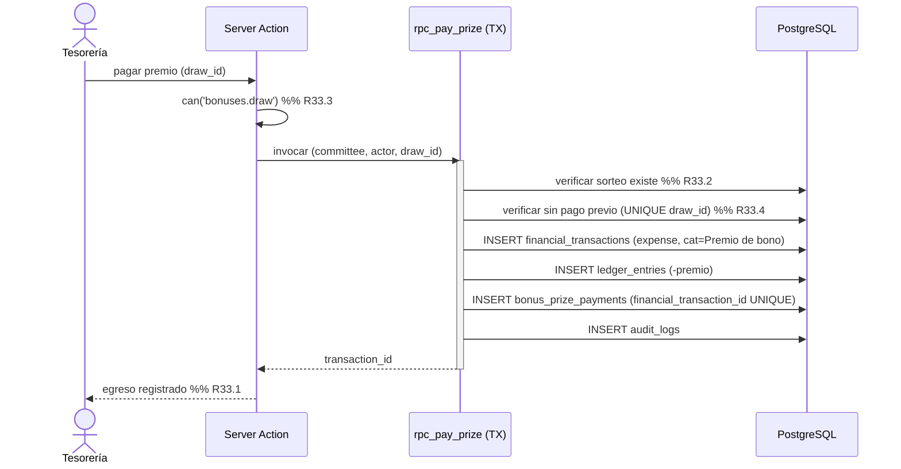
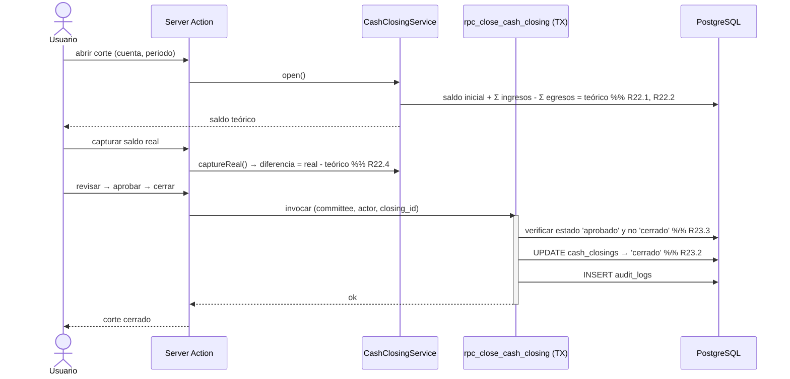

# Design Document — SAC (Sistema de Administración Comunitaria)

## Overview

SAC es una plataforma **multi-tenant (multi-comité)** para administrar las operaciones financieras y organizativas de comités de ayuda comunitaria. El sistema centraliza ingresos, egresos, transferencias internas, aportaciones voluntarias, donaciones, actividades, cortes mensuales de caja, miembros, usuarios, comprobantes y un sistema anual de bonos (números, beneficiarios, vendedores, cobros, entregas, sorteos y premios).

Este diseño deriva del documento fuente autoritativo #[[file:SAC_requerimientos_diseno_tecnico.md]] y de los 45 requerimientos EARS en `requirements.md`. Alinea con el stack y principios ya acordados y los concreta en contratos de servicio, esquema PostgreSQL, políticas de seguridad y propiedades verificables.

### Objetivos de diseño

1. **Integridad financiera verificable.** El saldo nunca es un campo editable: es un valor derivado de un ledger de apuntes inmutables/reversables. Todo movimiento monetario se materializa en `financial_transactions` + `ledger_entries` (Requirements 10, 41).
2. **Aislamiento estricto entre comités.** Cada entidad de negocio lleva `committee_id UUID NOT NULL` y toda lectura/escritura pasa por RLS basada en membresía activa, más validación de servidor (Requirements 2, 3, 40).
3. **Atomicidad e idempotencia de operaciones críticas.** Confirmar entrega, pagar premio y cerrar corte se ejecutan en transacciones PostgreSQL atómicas vía RPC/Server Actions, con claves únicas que impiden doble contabilización (Requirements 17, 31, 33, 41).
4. **Separación dominio/contabilidad.** Una operación de negocio (por ejemplo `bonus_settlement`) genera exactamente una transacción financiera vinculada mediante `financial_transaction_id UNIQUE` (Requirements 17, 18, 31, 33).
5. **Trazabilidad y auditoría inmutable.** Toda operación sensible es atribuible a usuario y fecha y queda en `audit_logs`, que no se modifica desde operaciones normales (Requirements 36, 41).
6. **Mobile-first / PWA.** La interfaz es responsiva y prioriza captura rápida desde teléfono, con un portal de vendedor dedicado (Requirements 39, 42, 43).

### Principios rectores (del documento fuente, secciones 13, 21)

- Montos en `NUMERIC`, nunca `float`.
- Movimientos contabilizados no se borran; se corrigen con reversas/ajustes.
- Operaciones sensibles centralizadas en el servidor; la `service_role` key jamás se expone al navegador.
- Comprobantes en buckets privados, accesibles solo por Signed_URL de duración limitada.

## Architecture

### Vista de capas

SAC sigue una arquitectura por capas donde la lógica crítica reside en el servidor (Server Actions / RPC de PostgreSQL) y nunca depende del cliente.



**Responsabilidad por capa:**

| Capa | Responsabilidad | Ubicación |
|---|---|---|
| UI | Renderizado responsivo, validación inmediata de formularios, confirmación explícita de acciones críticas (Requirements 42, 43) | Cliente (React Server/Client Components) |
| Server Actions / API | Verificación de sesión, resolución del comité activo, evaluación RBAC, orquestación de servicios, generación de Signed_URL | Servidor Next.js |
| Servicios de aplicación | Reglas de negocio de dominio, validaciones, composición de operaciones | Servidor Next.js |
| PostgreSQL RPC | Operaciones atómicas multi-tabla (confirmar entrega, pagar premio, cerrar corte, registrar ingreso/egreso/transferencia) dentro de una única transacción | PostgreSQL (funciones `SECURITY DEFINER` controladas) |
| RLS / RBAC | Filtrado por `committee_id` y verificación de permisos a nivel de fila | PostgreSQL |
| Ledger | Persistencia inmutable de apuntes financieros; fuente de verdad del saldo | PostgreSQL |

### Reglas de frontera de confianza

- El navegador usa exclusivamente la clave anónima de Supabase; todas las lecturas quedan sujetas a RLS.
- La `service_role` key solo se usa en Server Actions/RPC del servidor y nunca se envía al cliente (Requirements 40.3).
- Operaciones que abarcan varias tablas y deben ser atómicas se ejecutan como funciones RPC de PostgreSQL, no como múltiples llamadas del cliente (Requirements 11.1, 17.4, 18.6, 31.3, 33.1, 41.2).

### Servicios de aplicación

Los servicios encapsulan la lógica de negocio. Los servicios del documento fuente (sección 20) se mapean a los componentes lógicos del glosario de requerimientos:

| Servicio de aplicación | Componentes lógicos (glosario) | Requerimientos principales |
|---|---|---|
| **CommitteeService** | Committee_Service | 1, 2, 3, 44 |
| **MemberService** | Member_Service | 7, 8 |
| **FinanceService** | Account_Service, Ledger_Service, Transaction_Service, Attachment_Service | 9, 10, 11, 12, 13, 14, 15, 16, 41 |
| **CashClosingService** | Cash_Closing_Service | 22, 23 |
| **ActivityService** | Activity_Service | 19, 20, 21 |
| **ContributionService** | Contribution_Service | 17 |
| **DonationService** | Donation_Service | 18 |
| **BonusCampaignService** | Bonus_Campaign_Service | 24, 25, 26, 27, 34 |
| **BonusCollectionService** | Bonus_Collection_Service | 28, 29, 30 |
| **BonusSettlementService** | Bonus_Settlement_Service | 31 |
| **BonusDrawService** | Bonus_Draw_Service | 32, 33, 34 |
| **ReportService** | Report_Service, Dashboard_Service | 35, 37, 38, 45 |
| **AuditService** | Audit_Service | 36 |

Transversalmente, **Auth_Service** y **Authorization_Service** son atendidos por la capa Server Actions apoyándose en Supabase Auth y en las funciones RLS/RBAC (Requirements 4, 5, 6, 40). El **Seller_Portal** es una superficie de UI mobile-first que consume FinanceService, BonusCollectionService y BonusSettlementService bajo autorización restringida (Requirement 39).

## Components and Interfaces

Las firmas se expresan en TypeScript conceptual para los servicios de aplicación y en firmas SQL para las funciones RPC atómicas. Los montos usan un tipo `Money` (cadena decimal o entero de centavos) que se persiste como `NUMERIC`; nunca `number` de punto flotante (Requirements 41.1).

### Convenciones comunes

```ts
type UUID = string;
type Money = string;              // decimal exacto, ej. "150.00" — nunca float
type Period = string;             // 'YYYY-MM' → primer día del periodo (DATE)

interface Ctx {                   // contexto autenticado resuelto en el servidor
  userId: UUID;
  committeeId: UUID;              // comité activo
  permissions: string[];         // permisos efectivos (unión de roles)
  isSuperAdmin: boolean;
}

type Result<T> =
  | { ok: true; value: T }
  | { ok: false; error: { code: string; message: string; field?: string } };
```

Toda operación de escritura recibe `Ctx` y **debe** validar (a) que `committeeId` corresponda a una membresía activa o superadmin (Requirements 2.4, 2.6) y (b) que `permissions` contenga el permiso requerido (Requirement 6.2), antes de tocar datos.

### CommitteeService (Requirements 1, 2, 3, 44)

```ts
interface CommitteeService {
  create(ctx: Ctx, data: CommitteeInput): Promise<Result<{ committeeId: UUID }>>;   // R1.1–1.3, R44.1
  updateStatus(ctx: Ctx, id: UUID, status: CommitteeStatus): Promise<Result<void>>; // R1.4
  updateConfig(ctx: Ctx, id: UUID, patch: CommitteeConfigPatch): Promise<Result<void>>; // R3.1–3.4
  seedDefaultCategories(committeeId: UUID): Promise<void>;                          // R13.2
}
```

Responsabilidades: validar nombre no vacío (R1.2), asignar `committee_id` único (R1.3), aplicar cambios de configuración solo al comité del administrador y preservar los demás (R3.1, R3.2), validar longitudes/valores (R3.4) y registrar cambios de estado en auditoría (R1.4). Al crear un comité, siembra las categorías iniciales (R13.2).

### MemberService (Requirements 7, 8)

```ts
interface MemberService {
  register(ctx: Ctx, data: MemberInput): Promise<Result<{ memberId: UUID }>>;  // R7.1–7.5, R8.1
  linkUser(ctx: Ctx, memberId: UUID, userId: UUID): Promise<Result<void>>;     // R8.2 (máx. 1 miembro por usuario)
}
```

Valida nombre 1–150 caracteres (R7.1, R7.3), estado en {activo, inactivo, baja} con default `activo` (R7.2, R7.4), teléfono ≤30 y notas ≤500 (R7.5); permite miembros sin cuenta (R8.1) y a lo sumo un miembro por usuario (R8.2).

### FinanceService (Requirements 9–16, 41)

Agrupa cuentas, ledger, transacciones y comprobantes. Las operaciones que crean apuntes delegan en RPC atómicas.

```ts
interface FinanceService {
  // Cuentas — R9
  createAccount(ctx: Ctx, data: AccountInput): Promise<Result<{ accountId: UUID }>>; // R9.1, R9.2
  deactivateAccount(ctx: Ctx, accountId: UUID): Promise<Result<void>>;               // R9.3
  getDerivedBalance(ctx: Ctx, accountId: UUID): Promise<Result<Money>>;              // R10.1, R10.3

  // Movimientos — R12, R14, R15
  registerIncome(ctx: Ctx, data: IncomeInput): Promise<Result<{ transactionId: UUID }>>;  // R12
  registerExpense(ctx: Ctx, data: ExpenseInput): Promise<Result<{ transactionId: UUID }>>; // R14
  approve(ctx: Ctx, transactionId: UUID): Promise<Result<void>>;                     // R15.2
  void(ctx: Ctx, transactionId: UUID, reason: string): Promise<Result<{ reversalId: UUID }>>; // R15.3

  // Transferencias — R11
  transfer(ctx: Ctx, data: TransferInput): Promise<Result<{ transactionId: UUID }>>; // R11

  // Categorías — R13
  createCategory(ctx: Ctx, name: string): Promise<Result<{ categoryId: UUID }>>;     // R13.1, R13.3, R13.5
  renameCategory(ctx: Ctx, id: UUID, name: string): Promise<Result<void>>;           // R13.1, R13.3, R13.5
  deleteCategory(ctx: Ctx, id: UUID): Promise<Result<void>>;                         // R13.4

  // Comprobantes — R16
  attach(ctx: Ctx, transactionId: UUID, file: FileUpload): Promise<Result<{ attachmentId: UUID }>>; // R16.1
  getSignedUrl(ctx: Ctx, attachmentId: UUID): Promise<Result<{ url: string; expiresAt: string }>>;  // R16.2, R16.3
}
```

#### RPC atómicas (PostgreSQL) usadas por FinanceService

```sql
-- Registrar ingreso: crea transacción + apunte positivo en cuenta receptora (R12.1, R12.5)
CREATE FUNCTION rpc_register_income(
  p_committee_id UUID, p_actor UUID, p_account_id UUID, p_category_id UUID,
  p_activity_id UUID, p_amount NUMERIC, p_date DATE, p_description TEXT, ...
) RETURNS UUID;  -- retorna transaction_id; rechaza monto<=0, >límite, cuenta inactiva/ajena

-- Registrar egreso: crea transacción + apunte negativo en cuenta origen (R14.1, R14.4)
CREATE FUNCTION rpc_register_expense(
  p_committee_id UUID, p_actor UUID, p_account_id UUID, p_category_id UUID,
  p_amount NUMERIC, p_date DATE, p_beneficiary TEXT, p_description TEXT, ...
) RETURNS UUID;

-- Transferencia: dos apuntes que suman cero, atómicos (R11.1, R11.2)
CREATE FUNCTION rpc_transfer(
  p_committee_id UUID, p_actor UUID, p_from_account UUID, p_to_account UUID, p_amount NUMERIC
) RETURNS UUID;  -- rechaza misma cuenta, cuentas de otro comité, saldo insuficiente

-- Anulación: transacción compensatoria vinculada al original (R15.3, R15.4)
CREATE FUNCTION rpc_void_transaction(
  p_committee_id UUID, p_actor UUID, p_transaction_id UUID, p_reason TEXT
) RETURNS UUID;  -- reversal_of = p_transaction_id; nunca elimina físicamente
```

Cada RPC valida comité, permiso y estado, escribe `audit_logs` en la misma transacción y hace rollback total ante cualquier fallo (Requirements 41.2, 41.3, 36.4).

### CashClosingService (Requirements 22, 23)

```ts
interface CashClosingService {
  open(ctx: Ctx, accountId: UUID, period: Period): Promise<Result<{ closingId: UUID; theoretical: Money }>>; // R22.1–22.3
  captureReal(ctx: Ctx, closingId: UUID, realBalance: Money): Promise<Result<{ difference: Money }>>;        // R22.4, R22.5
  review(ctx: Ctx, closingId: UUID): Promise<Result<void>>;   // R23.1
  approve(ctx: Ctx, closingId: UUID): Promise<Result<void>>;  // R23.1
  close(ctx: Ctx, closingId: UUID): Promise<Result<void>>;    // R23.2, R23.3 (rechaza doble cierre)
}
```

RPC atómica de cierre `rpc_close_cash_closing(p_committee_id, p_actor, p_closing_id)` valida estado `aprobado`→`cerrado`, rechaza si ya está cerrado (R23.3) y audita. Los cambios retroactivos sobre un corte cerrado requieren ajuste autorizado y auditoría (R23.4).

### ActivityService (Requirements 19, 20, 21)

```ts
interface ActivityService {
  create(ctx: Ctx, data: ActivityInput): Promise<Result<{ activityId: UUID }>>;  // R19.1, R19.2
  computeResult(ctx: Ctx, activityId: UUID): Promise<Result<Money>>;             // R20.3–20.5
  closeCut(ctx: Ctx, activityId: UUID): Promise<Result<ActivityCut>>;            // R21.1–21.6
}
```

Valida fecha fin ≥ inicio (R19.2); el resultado suma ingresos aprobados menos egresos aprobados, excluyendo no aprobados y anulados (R20.3, R20.4); recalcula al asociar/desasociar/aprobar/anular (R20.5); el corte solo procede desde estado `finalizada` con permiso y bloquea doble cierre (R21.2–21.5).

### ContributionService (Requirement 17)

```ts
interface ContributionService {
  register(ctx: Ctx, data: ContributionInput): Promise<Result<{ contributionId: UUID }>>; // R17.1–17.3
  confirmMonetary(ctx: Ctx, contributionId: UUID): Promise<Result<{ transactionId: UUID }>>; // R17.4, R17.5
}
```

Estados en {registrada, sin_aportacion, exento, no_aplica} (R17.1); nunca genera adeudo automático (R17.3); al confirmar, vincula exactamente una `financial_transaction` de ingreso y rechaza doble vinculación (R17.4, R17.5).

### DonationService (Requirement 18)

```ts
interface DonationService {
  register(ctx: Ctx, data: DonationInput): Promise<Result<{ donationId: UUID }>>; // R18.1–18.5
  confirmMonetary(ctx: Ctx, donationId: UUID): Promise<Result<{ transactionId: UUID }>>; // R18.6, R18.7
}
```

Valida tipo/origen contra conjuntos cerrados (R18.1, R18.2), campos de especie (R18.3, R18.4); marca valor estimado sin tocar el saldo de efectivo (R18.5); confirma monetarias en una única transacción con rollback total ante fallo (R18.6, R18.7).

### BonusCampaignService (Requirements 24, 25, 26, 27, 34)

```ts
interface BonusCampaignService {
  createCampaign(ctx: Ctx, data: CampaignInput): Promise<Result<{ campaignId: UUID }>>; // R24.1–24.5
  generateNumbers(ctx: Ctx, campaignId: UUID): Promise<Result<{ created: number }>>;    // R25.1, R25.2
  assignHolder(ctx: Ctx, bonusNumberId: UUID, holder: HolderInput): Promise<Result<void>>; // R26.1, R26.2
  assignSellers(ctx: Ctx, campaignId: UUID, sellerId: UUID, numberIds: UUID[]): Promise<Result<void>>; // R27.1–27.5
  saveEligibilityRules(ctx: Ctx, campaignId: UUID, rules: EligibilityRules): Promise<Result<void>>;    // R34.1, R34.2
}
```

Valida año/rango/montos/meses y unicidad por año (R24.1–24.5); genera números únicos en el rango (R25.1, R25.2); conserva historial de titularidad al cambiar beneficiario (R26.1, R26.2); mantiene a lo sumo un vendedor vigente por número cerrando la asignación previa (R27.4, R27.5); persiste los seis parámetros de reglas con atribución (R34.1, R34.2).

### BonusCollectionService (Requirements 28, 29, 30)

```ts
interface BonusCollectionService {
  generateMonthlyDues(ctx: Ctx, campaignId: UUID, period: Period): Promise<Result<{ created: number }>>; // R29.1, R29.2
  recordCollection(ctx: Ctx, dueId: UUID, amount: Money): Promise<Result<{ collectionId: UUID }>>;       // R30.1–30.3
  sellerStatus(ctx: Ctx, sellerId: UUID, period: Period): Promise<Result<SellerStatus>>;                 // R28.1
}
```

Genera una mensualidad por número activo por periodo, con UNIQUE(número, periodo) (R29.1, R29.2); ciclo pendiente→cobrado_vendedor→entregado_tesoreria→confirmado con bitácora de transición (R29.3, R29.4); al cobrar, transiciona a `cobrado_vendedor` sin tocar el saldo del comité (R30.1, R30.2); rechaza monto ≤ 0 (R30.3).

### BonusSettlementService (Requirement 31)

```ts
interface BonusSettlementService {
  report(ctx: Ctx, sellerId: UUID, collectionIds: UUID[], reference: string): Promise<Result<{ settlementId: UUID }>>; // R31.1, R31.2
  confirm(ctx: Ctx, settlementId: UUID): Promise<Result<{ transactionId: UUID }>>; // R31.3–31.6
}
```

RPC atómica `rpc_confirm_settlement(p_committee_id, p_actor, p_settlement_id)`:
- Rechaza si `p_actor` es el vendedor que reportó (R31.4).
- Rechaza si la entrega ya está `confirmada` (R31.5).
- En una sola transacción: crea `financial_transaction` de ingreso categoría Bonos, transiciona mensualidades incluidas a `confirmado`, registra monto/fecha/usuario de confirmación, marca la entrega `confirmada` y escribe auditoría (R31.3).
- Rollback total ante fallo, dejando la entrega en `reportada` (R31.6).
- Idempotencia garantizada por `bonus_settlements.financial_transaction_id UNIQUE` (Requirements 41.4).

### BonusDrawService (Requirements 32, 33, 34)

```ts
interface BonusDrawService {
  registerDraw(ctx: Ctx, data: DrawInput): Promise<Result<{ drawId: UUID }>>;      // R32.1, R32.2, R34.3, R34.4
  payPrize(ctx: Ctx, drawId: UUID): Promise<Result<{ transactionId: UUID }>>;      // R33.1–33.5
}
```

RPC atómica `rpc_pay_prize(p_committee_id, p_actor, p_draw_id)`:
- Rechaza si el sorteo no existe (R33.2) o falta permiso (R33.3).
- Rechaza segundo pago (R33.4) apoyándose en `bonus_prize_payments.financial_transaction_id UNIQUE` y UNIQUE(draw_id).
- Crea egreso categoría "Premio de bono" con monto = premio del sorteo, vincula `prize_payment`, audita, todo atómico con rollback total (R33.1, R33.5).
El registro de sorteo respeta UNIQUE(campaign_id, period) (R32.2) y exige las seis reglas definidas antes de ejecutar (R34.3, R34.4).

### ReportService (Requirements 35, 37, 38, 45)

```ts
interface ReportService {
  bonusMonthlyCut(ctx: Ctx, campaignId: UUID, period: Period): Promise<Result<BonusCut>>; // R35.1
  generate(ctx: Ctx, type: ReportType, params: ReportParams): Promise<Result<ReportData>>; // R37.1
  export(ctx: Ctx, report: ReportData, format: 'pdf'|'xlsx'|'csv'): Promise<Result<FileRef>>; // R37.2
  dashboard(ctx: Ctx, period: Period): Promise<Result<DashboardIndicators>>; // R38.1, R38.2, R45.1
}
```

Todos los reportes/indicadores se restringen al `committee_id` del contexto (R37.1, R38.2) y usan agregaciones/índices del lado del servidor (R45.1).

### AuditService (Requirement 36)

```ts
interface AuditService {
  record(tx: DbTransaction, entry: AuditEntry): Promise<void>; // R36.1, R36.3, R36.4 — se invoca dentro de la misma transacción
  query(ctx: Ctx, filter: AuditFilter): Promise<Result<AuditEntry[]>>; // R36.5 (solo lectura, incl. auditor)
}
```

`record` participa en la transacción de la operación sensible; si falla, la operación se revierte (R36.4). La inmutabilidad de `audit_logs` se garantiza a nivel de base de datos (sin políticas de UPDATE/DELETE para roles de aplicación) (R36.2).

### Auth / Authorization (Requirements 4, 5, 6, 40)

Implementados en la capa Server Actions sobre Supabase Auth y funciones SQL:

```ts
interface AuthGateway {
  signIn(email: string, password: string): Promise<Result<Session>>;   // R4.1–4.3
  requestReset(email: string): Promise<Result<void>>;                   // R4.4, R4.5 (respuesta genérica)
  signOut(session: Session): Promise<Result<void>>;                     // R4.6
  resolveActiveCommittee(session: Session): Promise<Result<UUID | 'choose'>>; // R4.8, R4.9
}

interface Authorization {
  effectivePermissions(userId: UUID, committeeId: UUID): Promise<string[]>; // R6.3
  can(ctx: Ctx, permission: string): boolean;                               // R6.2
  assertCommitteeAccess(ctx: Ctx, committeeId: UUID): void;                 // R2.4, R2.6
}
```

## Data Models

Esquema PostgreSQL alineado al modelo preliminar del documento fuente (sección 14) y refinado con los requerimientos EARS. Convenciones:

- Todas las tablas de comité incluyen `committee_id UUID NOT NULL REFERENCES committees(id)` (Requirements 2.1).
- Los montos son `NUMERIC(16,2)` (nunca float) (Requirements 41.1).
- `created_at` es `TIMESTAMPTZ NOT NULL DEFAULT now()`.
- Los estados usan `TEXT` con `CHECK` sobre conjuntos cerrados.

### Identidad y autorización

```sql
CREATE TABLE committees (
  id UUID PRIMARY KEY DEFAULT gen_random_uuid(),
  name TEXT NOT NULL CHECK (length(trim(name)) BETWEEN 1 AND 150),  -- R1.2
  slug TEXT UNIQUE,
  logo_path TEXT,
  locality TEXT, phone TEXT, email TEXT,
  status TEXT NOT NULL DEFAULT 'active' CHECK (status IN ('active','inactive','suspended')),
  finance_settings JSONB NOT NULL DEFAULT '{}',
  bonus_settings JSONB NOT NULL DEFAULT '{}',
  settings JSONB NOT NULL DEFAULT '{}',
  created_at TIMESTAMPTZ NOT NULL DEFAULT now()
);  -- R1.1, R1.3

CREATE TABLE profiles (
  id UUID PRIMARY KEY REFERENCES auth.users(id),
  full_name TEXT, phone TEXT,
  created_at TIMESTAMPTZ NOT NULL DEFAULT now()
);

CREATE TABLE committee_users (
  id UUID PRIMARY KEY DEFAULT gen_random_uuid(),
  committee_id UUID NOT NULL REFERENCES committees(id),
  user_id UUID NOT NULL REFERENCES auth.users(id),
  member_id UUID,                                    -- vínculo opcional (R8.2)
  status TEXT NOT NULL DEFAULT 'active' CHECK (status IN ('active','inactive')),
  created_at TIMESTAMPTZ NOT NULL DEFAULT now(),
  UNIQUE (committee_id, user_id),                    -- membresía única
  UNIQUE (committee_id, member_id)                   -- máx. 1 miembro por usuario/comité (R8.2)
);  -- R2.4 (status='active' habilita acceso)

CREATE TABLE roles (
  id UUID PRIMARY KEY DEFAULT gen_random_uuid(),
  key TEXT NOT NULL CHECK (key IN
    ('superadmin','committee_admin','president','treasurer','secretary',
     'clerk','bonus_seller','auditor','member')),  -- exactamente 9 roles (R5.1)
  name TEXT NOT NULL,
  UNIQUE (key)
);

CREATE TABLE permissions (
  id UUID PRIMARY KEY DEFAULT gen_random_uuid(),
  key TEXT NOT NULL UNIQUE CHECK (key IN
    ('members.read','members.create','members.update',
     'transactions.read','transactions.create','transactions.approve','transactions.void',
     'cash_closings.create','cash_closings.review','cash_closings.close',
     'bonuses.read','bonuses.collect','bonuses.settle','bonuses.draw',
     'reports.read','users.manage','committee.manage','audit.read'))  -- R6.1
);

CREATE TABLE role_permissions (
  role_id UUID NOT NULL REFERENCES roles(id),
  permission_id UUID NOT NULL REFERENCES permissions(id),
  PRIMARY KEY (role_id, permission_id)
);

CREATE TABLE user_roles (
  id UUID PRIMARY KEY DEFAULT gen_random_uuid(),
  committee_id UUID NOT NULL REFERENCES committees(id),
  user_id UUID NOT NULL REFERENCES auth.users(id),
  role_id UUID NOT NULL REFERENCES roles(id),
  UNIQUE (committee_id, user_id, role_id)            -- R5.2; permisos = unión de roles (R6.3)
);
```

### Miembros

```sql
CREATE TABLE members (
  id UUID PRIMARY KEY DEFAULT gen_random_uuid(),
  committee_id UUID NOT NULL REFERENCES committees(id),
  full_name TEXT NOT NULL CHECK (length(full_name) BETWEEN 1 AND 150),   -- R7.1, R7.3
  phone TEXT CHECK (phone IS NULL OR length(phone) <= 30),               -- R7.5
  joined_at DATE,
  position TEXT,
  status TEXT NOT NULL DEFAULT 'activo' CHECK (status IN ('activo','inactivo','baja')), -- R7.2, R7.4
  notes TEXT CHECK (notes IS NULL OR length(notes) <= 500),              -- R7.5
  created_at TIMESTAMPTZ NOT NULL DEFAULT now(),
  created_by UUID
);
```

### Finanzas

```sql
CREATE TABLE financial_accounts (
  id UUID PRIMARY KEY DEFAULT gen_random_uuid(),
  committee_id UUID NOT NULL REFERENCES committees(id),
  name TEXT NOT NULL CHECK (length(name) BETWEEN 1 AND 80),   -- R9.1, R9.2
  type TEXT NOT NULL CHECK (type IN
    ('caja_general','cuenta_bancaria','caja_actividad','cuenta_digital','otra')),
  opening_balance NUMERIC(16,2) NOT NULL DEFAULT 0,           -- saldo inicial (R10.1)
  status TEXT NOT NULL DEFAULT 'active' CHECK (status IN ('active','inactive')), -- R9.3, R9.4
  created_at TIMESTAMPTZ NOT NULL DEFAULT now(),
  UNIQUE (committee_id, name)                                 -- nombre único por comité (R9.2)
);
-- No hay columna de saldo editable: el saldo es derivado (R10.1, R10.2)

CREATE TABLE transaction_categories (
  id UUID PRIMARY KEY DEFAULT gen_random_uuid(),
  committee_id UUID NOT NULL REFERENCES committees(id),
  name TEXT NOT NULL CHECK (length(trim(name)) BETWEEN 1 AND 100),  -- R13.5
  created_at TIMESTAMPTZ NOT NULL DEFAULT now(),
  UNIQUE (committee_id, name)                                 -- nombre único por comité (R13.3)
);

CREATE TABLE financial_transactions (
  id UUID PRIMARY KEY DEFAULT gen_random_uuid(),
  committee_id UUID NOT NULL REFERENCES committees(id),
  type TEXT NOT NULL CHECK (type IN ('income','expense','transfer','adjustment')),
  status TEXT NOT NULL DEFAULT 'draft' CHECK (status IN ('draft','posted','reversed')), -- R15.1
  transaction_date DATE NOT NULL,
  description TEXT,
  category_id UUID REFERENCES transaction_categories(id),
  activity_id UUID REFERENCES activities(id),                 -- máx. 1 actividad (R20.1)
  source_type TEXT,                                           -- 'contribution'|'donation'|'settlement'|'prize'|null
  source_id UUID,
  created_by UUID NOT NULL,                                   -- atribución (R12.6, R36.3)
  approved_by UUID,
  created_at TIMESTAMPTZ NOT NULL DEFAULT now(),              -- fecha/hora captura (R12.6)
  posted_at TIMESTAMPTZ,
  reversal_of UUID REFERENCES financial_transactions(id)      -- anulación compensatoria (R15.3)
);

CREATE TABLE ledger_entries (
  id UUID PRIMARY KEY DEFAULT gen_random_uuid(),
  committee_id UUID NOT NULL REFERENCES committees(id),
  transaction_id UUID NOT NULL REFERENCES financial_transactions(id),
  account_id UUID NOT NULL REFERENCES financial_accounts(id),
  amount NUMERIC(16,2) NOT NULL,                              -- positivo=crédito, negativo=débito
  created_at TIMESTAMPTZ NOT NULL DEFAULT now()
);
-- Invariante de transferencia: SUM(amount)=0 por transaction_id cuando type='transfer' (R11.2)
-- Derived_Balance(cuenta) = opening_balance + SUM(ledger_entries.amount) (R10.1)

CREATE TABLE transaction_attachments (
  id UUID PRIMARY KEY DEFAULT gen_random_uuid(),
  committee_id UUID NOT NULL REFERENCES committees(id),
  transaction_id UUID NOT NULL REFERENCES financial_transactions(id),
  storage_path TEXT NOT NULL,                                 -- bucket privado (R16.1)
  kind TEXT CHECK (kind IN ('imagen','ticket','factura','recibo','pdf','otro')),
  uploaded_by UUID NOT NULL,
  created_at TIMESTAMPTZ NOT NULL DEFAULT now()
);

CREATE TABLE transfers (
  id UUID PRIMARY KEY DEFAULT gen_random_uuid(),
  committee_id UUID NOT NULL REFERENCES committees(id),
  transaction_id UUID NOT NULL UNIQUE REFERENCES financial_transactions(id),
  from_account_id UUID NOT NULL REFERENCES financial_accounts(id),
  to_account_id UUID NOT NULL REFERENCES financial_accounts(id),
  amount NUMERIC(16,2) NOT NULL CHECK (amount >= 0.01),       -- R11.1, R11.6
  created_at TIMESTAMPTZ NOT NULL DEFAULT now(),
  CHECK (from_account_id <> to_account_id)                    -- cuentas distintas (R11.5)
);

CREATE TABLE cash_closings (
  id UUID PRIMARY KEY DEFAULT gen_random_uuid(),
  committee_id UUID NOT NULL REFERENCES committees(id),
  account_id UUID NOT NULL REFERENCES financial_accounts(id),
  period DATE NOT NULL,                                       -- primer día del periodo
  opening_balance NUMERIC(16,2) NOT NULL,
  theoretical_balance NUMERIC(16,2) NOT NULL,                 -- R22.1, R22.2
  real_balance NUMERIC(16,2) CHECK (real_balance IS NULL OR (real_balance BETWEEN 0 AND 999999999.99)), -- R22.5
  difference NUMERIC(16,2),                                   -- real - teórico (R22.4)
  status TEXT NOT NULL DEFAULT 'abierto' CHECK (status IN ('abierto','en_revision','aprobado','cerrado')), -- R23.1
  created_at TIMESTAMPTZ NOT NULL DEFAULT now(),
  UNIQUE (committee_id, account_id, period)                  -- un corte por cuenta/periodo (R23.3)
);

CREATE TABLE cash_closing_details (
  id UUID PRIMARY KEY DEFAULT gen_random_uuid(),
  committee_id UUID NOT NULL REFERENCES committees(id),
  cash_closing_id UUID NOT NULL REFERENCES cash_closings(id),
  concept TEXT NOT NULL,
  amount NUMERIC(16,2) NOT NULL
);
```

### Aportaciones y donaciones

```sql
CREATE TABLE contributions (
  id UUID PRIMARY KEY DEFAULT gen_random_uuid(),
  committee_id UUID NOT NULL REFERENCES committees(id),
  member_id UUID NOT NULL REFERENCES members(id),
  period DATE NOT NULL,
  contributed_at DATE NOT NULL,
  amount NUMERIC(16,2) CHECK (amount IS NULL OR amount > 0),  -- R17.2
  method TEXT,
  account_id UUID REFERENCES financial_accounts(id),
  status TEXT NOT NULL CHECK (status IN ('registrada','sin_aportacion','exento','no_aplica')), -- R17.1
  financial_transaction_id UUID UNIQUE REFERENCES financial_transactions(id), -- 1 ingreso, sin doble vínculo (R17.4, R17.5)
  created_at TIMESTAMPTZ NOT NULL DEFAULT now()
);

CREATE TABLE donations (
  id UUID PRIMARY KEY DEFAULT gen_random_uuid(),
  committee_id UUID NOT NULL REFERENCES committees(id),
  type TEXT NOT NULL CHECK (type IN ('dinero','material','bien','servicio','otro')),   -- R18.1, R18.2
  origin TEXT NOT NULL CHECK (origin IN ('persona','empresa','institucion','anonimo')), -- R18.1, R18.2
  description TEXT CHECK (description IS NULL OR length(description) BETWEEN 1 AND 500), -- R18.3
  quantity NUMERIC(16,2) CHECK (quantity IS NULL OR (quantity > 0 AND quantity <= 999999999.99)), -- R18.3, R18.4
  estimated_value NUMERIC(16,2) CHECK (estimated_value IS NULL OR (estimated_value BETWEEN 0.01 AND 999999999.99)), -- R18.3
  is_estimated BOOLEAN NOT NULL DEFAULT false,               -- marca "estimado" (R18.5)
  destination TEXT CHECK (destination IS NULL OR length(destination) BETWEEN 1 AND 200), -- R18.3
  confirmed BOOLEAN NOT NULL DEFAULT false,
  financial_transaction_id UUID UNIQUE REFERENCES financial_transactions(id), -- R18.6
  created_at TIMESTAMPTZ NOT NULL DEFAULT now()
);
```

### Actividades

```sql
CREATE TABLE activities (
  id UUID PRIMARY KEY DEFAULT gen_random_uuid(),
  committee_id UUID NOT NULL REFERENCES committees(id),
  name TEXT NOT NULL,
  objective TEXT,
  start_date DATE NOT NULL,
  end_date DATE NOT NULL,
  responsible TEXT,
  description TEXT,
  status TEXT NOT NULL DEFAULT 'planeada' CHECK (status IN ('planeada','activa','finalizada','cerrada')), -- R19.1
  created_at TIMESTAMPTZ NOT NULL DEFAULT now(),
  CHECK (end_date >= start_date)                             -- R19.2
);

CREATE TABLE activity_members (
  activity_id UUID NOT NULL REFERENCES activities(id),
  member_id UUID NOT NULL REFERENCES members(id),
  committee_id UUID NOT NULL REFERENCES committees(id),
  PRIMARY KEY (activity_id, member_id)
);
```

### Bonos

```sql
CREATE TABLE bonus_campaigns (
  id UUID PRIMARY KEY DEFAULT gen_random_uuid(),
  committee_id UUID NOT NULL REFERENCES committees(id),
  name TEXT NOT NULL,
  year INT NOT NULL CHECK (year BETWEEN 2000 AND 2100),      -- R24.1
  number_start INT NOT NULL CHECK (number_start >= 1),
  number_end INT NOT NULL CHECK (number_end <= 999999999),
  monthly_amount NUMERIC(16,2) NOT NULL CHECK (monthly_amount > 0),  -- R24.3
  monthly_prize NUMERIC(16,2) NOT NULL CHECK (monthly_prize > 0),    -- R24.3
  active_months INT NOT NULL CHECK (active_months BETWEEN 1 AND 12), -- R24.4
  start_date DATE, end_date DATE,
  rules JSONB,                                               -- 6 parámetros (R34.1, R34.2)
  rules_defined BOOLEAN NOT NULL DEFAULT false,              -- R34.2, R34.3
  status TEXT NOT NULL DEFAULT 'borrador' CHECK (status IN ('borrador','activa','cerrada')), -- R24.1
  created_at TIMESTAMPTZ NOT NULL DEFAULT now(),
  CHECK (number_end >= number_start),                        -- R24.2
  UNIQUE (committee_id, year)                                -- una campaña por año (R24.5)
);

CREATE TABLE bonus_numbers (
  id UUID PRIMARY KEY DEFAULT gen_random_uuid(),
  committee_id UUID NOT NULL REFERENCES committees(id),
  campaign_id UUID NOT NULL REFERENCES bonus_campaigns(id),
  number INT NOT NULL,
  status TEXT NOT NULL DEFAULT 'activo' CHECK (status IN ('activo','inactivo')),
  UNIQUE (campaign_id, number)                               -- número único por campaña (R25.2)
);

CREATE TABLE bonus_holder_assignments (
  id UUID PRIMARY KEY DEFAULT gen_random_uuid(),
  committee_id UUID NOT NULL REFERENCES committees(id),
  bonus_number_id UUID NOT NULL REFERENCES bonus_numbers(id),
  beneficiary_name TEXT NOT NULL,
  member_id UUID REFERENCES members(id),
  valid_from DATE NOT NULL,
  valid_to DATE,                                             -- NULL = vigente (R26.1, R26.2)
  created_by UUID
);
-- A lo sumo una asignación vigente (valid_to IS NULL) por bonus_number_id

CREATE TABLE bonus_sellers (
  id UUID PRIMARY KEY DEFAULT gen_random_uuid(),
  committee_id UUID NOT NULL REFERENCES committees(id),
  user_id UUID REFERENCES auth.users(id),
  member_id UUID REFERENCES members(id),
  display_name TEXT NOT NULL,
  created_at TIMESTAMPTZ NOT NULL DEFAULT now()
);

CREATE TABLE bonus_seller_assignments (
  id UUID PRIMARY KEY DEFAULT gen_random_uuid(),
  committee_id UUID NOT NULL REFERENCES committees(id),
  bonus_number_id UUID NOT NULL REFERENCES bonus_numbers(id),
  seller_id UUID NOT NULL REFERENCES bonus_sellers(id),
  valid_from TIMESTAMPTZ NOT NULL DEFAULT now(),
  valid_to TIMESTAMPTZ                                       -- NULL = vigente (R27.4, R27.5)
);
-- Índice único parcial: máx. 1 vendedor vigente por número
CREATE UNIQUE INDEX uq_active_seller_per_number
  ON bonus_seller_assignments (bonus_number_id) WHERE valid_to IS NULL; -- R27.5

CREATE TABLE bonus_monthly_dues (
  id UUID PRIMARY KEY DEFAULT gen_random_uuid(),
  committee_id UUID NOT NULL REFERENCES committees(id),
  campaign_id UUID NOT NULL REFERENCES bonus_campaigns(id),
  bonus_number_id UUID NOT NULL REFERENCES bonus_numbers(id),
  period DATE NOT NULL,
  amount NUMERIC(16,2) NOT NULL,
  status TEXT NOT NULL DEFAULT 'pendiente' CHECK (status IN
    ('pendiente','cobrado_vendedor','entregado_tesoreria','confirmado')), -- R29.3
  UNIQUE (bonus_number_id, period)                           -- una mensualidad por número/periodo (R29.2)
);

CREATE TABLE bonus_due_transitions (                         -- bitácora de transición (R29.4)
  id UUID PRIMARY KEY DEFAULT gen_random_uuid(),
  committee_id UUID NOT NULL REFERENCES committees(id),
  monthly_due_id UUID NOT NULL REFERENCES bonus_monthly_dues(id),
  from_status TEXT, to_status TEXT NOT NULL,
  actor UUID NOT NULL, reference TEXT,
  created_at TIMESTAMPTZ NOT NULL DEFAULT now()
);

CREATE TABLE bonus_collections (
  id UUID PRIMARY KEY DEFAULT gen_random_uuid(),
  committee_id UUID NOT NULL REFERENCES committees(id),
  monthly_due_id UUID NOT NULL REFERENCES bonus_monthly_dues(id),
  seller_id UUID NOT NULL REFERENCES bonus_sellers(id),
  amount NUMERIC(16,2) NOT NULL CHECK (amount > 0),          -- R30.3
  settlement_id UUID REFERENCES bonus_settlements(id),       -- agrupación en entrega
  collected_at TIMESTAMPTZ NOT NULL DEFAULT now(),
  created_by UUID
);

CREATE TABLE bonus_settlements (
  id UUID PRIMARY KEY DEFAULT gen_random_uuid(),
  committee_id UUID NOT NULL REFERENCES committees(id),
  campaign_id UUID NOT NULL REFERENCES bonus_campaigns(id),
  seller_id UUID NOT NULL REFERENCES bonus_sellers(id),
  reported_by UUID NOT NULL,                                 -- vendedor que reporta (R31.4)
  reference TEXT,
  reported_amount NUMERIC(16,2) NOT NULL CHECK (reported_amount BETWEEN 0.01 AND 999999999.99), -- R31.1, R31.2
  confirmed_amount NUMERIC(16,2),
  status TEXT NOT NULL DEFAULT 'reportada' CHECK (status IN ('reportada','confirmada','anulada')), -- R31.3, R31.5
  reported_at TIMESTAMPTZ NOT NULL DEFAULT now(),
  confirmed_at TIMESTAMPTZ,
  confirmed_by UUID,                                         -- distinto de reported_by (R31.4)
  financial_transaction_id UUID UNIQUE REFERENCES financial_transactions(id), -- idempotencia (R31.5, R41.4)
  CHECK (confirmed_by IS NULL OR confirmed_by <> reported_by) -- vendedor no confirma su entrega (R31.4)
);

CREATE TABLE bonus_settlement_items (
  settlement_id UUID NOT NULL REFERENCES bonus_settlements(id),
  collection_id UUID NOT NULL REFERENCES bonus_collections(id),
  committee_id UUID NOT NULL REFERENCES committees(id),
  PRIMARY KEY (settlement_id, collection_id)
);

CREATE TABLE bonus_draws (
  id UUID PRIMARY KEY DEFAULT gen_random_uuid(),
  committee_id UUID NOT NULL REFERENCES committees(id),
  campaign_id UUID NOT NULL REFERENCES bonus_campaigns(id),
  period DATE NOT NULL,
  draw_date DATE NOT NULL,
  winning_bonus_number_id UUID NOT NULL REFERENCES bonus_numbers(id),
  beneficiary_snapshot TEXT NOT NULL,                        -- beneficiario vigente (R32.1)
  prize_amount NUMERIC(16,2) NOT NULL CHECK (prize_amount > 0),
  evidence_path TEXT,
  responsible TEXT,
  status TEXT NOT NULL DEFAULT 'registrado' CHECK (status IN ('registrado','anulado')),
  created_at TIMESTAMPTZ NOT NULL DEFAULT now(),
  UNIQUE (campaign_id, period)                               -- un sorteo por campaña/periodo (R32.2)
);

CREATE TABLE bonus_prize_payments (
  id UUID PRIMARY KEY DEFAULT gen_random_uuid(),
  committee_id UUID NOT NULL REFERENCES committees(id),
  draw_id UUID NOT NULL UNIQUE REFERENCES bonus_draws(id),   -- un pago por sorteo (R33.4)
  amount NUMERIC(16,2) NOT NULL CHECK (amount > 0),          -- R33.1
  paid_at TIMESTAMPTZ NOT NULL DEFAULT now(),
  financial_transaction_id UUID NOT NULL UNIQUE REFERENCES financial_transactions(id), -- idempotencia (R33.4, R41.4)
  created_by UUID
);
```

### Auditoría y notificaciones

```sql
CREATE TABLE audit_logs (
  id UUID PRIMARY KEY DEFAULT gen_random_uuid(),
  committee_id UUID REFERENCES committees(id),               -- NULL para acciones globales
  user_id UUID NOT NULL,                                     -- atribución obligatoria (R36.1, R36.3)
  entity_type TEXT NOT NULL,
  entity_id UUID,
  action TEXT NOT NULL,
  old_values JSONB,
  new_values JSONB,
  reason TEXT,                                               -- requerido en eliminación/ajuste (R36.1)
  created_at TIMESTAMPTZ NOT NULL DEFAULT now()              -- fecha/hora con precisión de segundos
);
-- Inmutabilidad: sin políticas de UPDATE/DELETE para roles de aplicación (R36.2)

CREATE TABLE notifications (
  id UUID PRIMARY KEY DEFAULT gen_random_uuid(),
  committee_id UUID NOT NULL REFERENCES committees(id),
  user_id UUID NOT NULL,
  kind TEXT NOT NULL,
  payload JSONB,
  read_at TIMESTAMPTZ,
  created_at TIMESTAMPTZ NOT NULL DEFAULT now()
);
```

### Invariantes clave del modelo

| Invariante | Mecanismo | Requerimiento |
|---|---|---|
| Suma cero de apuntes de transferencia | Validación en `rpc_transfer` + `CHECK` de conciliación | R11.2 |
| Saldo derivado = opening + Σ apuntes | Vista/consulta; sin columna de saldo editable | R10.1, R10.2 |
| Una mensualidad por número/periodo | `UNIQUE(bonus_number_id, period)` | R29.2 |
| Un sorteo por campaña/periodo | `UNIQUE(campaign_id, period)` | R32.2 |
| Un pago de premio por sorteo | `UNIQUE(draw_id)` + `financial_transaction_id UNIQUE` | R33.4 |
| Entrega → un solo ingreso (idempotente) | `bonus_settlements.financial_transaction_id UNIQUE` | R31.5, R41.4 |
| Vendedor no confirma su entrega | `CHECK (confirmed_by <> reported_by)` | R31.4 |
| Un vendedor vigente por número | índice único parcial `WHERE valid_to IS NULL` | R27.5 |
| Nombre de cuenta único por comité | `UNIQUE(committee_id, name)` | R9.2 |
| Nombre de categoría único por comité | `UNIQUE(committee_id, name)` | R13.3 |
| Aislamiento multi-tenant | `committee_id NOT NULL` + RLS | R2.1 |

## Security Design

La seguridad de SAC se apoya en tres capas complementarias: **RLS** (aislamiento por fila), **RBAC** (permisos granulares) y **operaciones críticas en el servidor** (RPC/Server Actions con `service_role`). Alinea con RNF-001 del documento fuente #[[file:SAC_requerimientos_diseno_tecnico.md]] (Requirements 40).

### Modelo RLS multi-tenant (Requirements 2, 40.2)

Una función `SECURITY DEFINER` resuelve los comités con membresía activa del usuario autenticado:

```sql
-- Comités a los que el usuario tiene acceso activo (o todos si es superadmin)
CREATE FUNCTION current_user_committees()
RETURNS SETOF UUID
LANGUAGE sql STABLE SECURITY DEFINER AS $$
  SELECT cu.committee_id
  FROM committee_users cu
  WHERE cu.user_id = auth.uid()
    AND cu.status = 'active'                       -- membresía activa (R2.4)
  UNION
  SELECT c.id FROM committees c
  WHERE EXISTS (                                    -- superadmin: acceso global (R2.6)
    SELECT 1 FROM user_roles ur
    JOIN roles r ON r.id = ur.role_id
    WHERE ur.user_id = auth.uid() AND r.key = 'superadmin'
  );
$$;
```

**Política de lectura** (aplicada a cada tabla de comité):

```sql
ALTER TABLE financial_transactions ENABLE ROW LEVEL SECURITY;
CREATE POLICY read_own_committee ON financial_transactions
  FOR SELECT USING (committee_id IN (SELECT current_user_committees())); -- R2.2
```

Como RLS filtra a nivel de fila, un usuario ajeno no recibe ninguna fila ni el conteo de un comité no autorizado (Requirements 2.2). Esta política se replica en todas las tablas con `committee_id`.

**Política de escritura** (combina pertenencia + permiso RBAC):

```sql
CREATE POLICY write_with_permission ON financial_transactions
  FOR INSERT WITH CHECK (
    committee_id IN (SELECT current_user_committees())
    AND has_permission(auth.uid(), committee_id, 'transactions.create') -- R2.3, R6.2
  );
```

Las escrituras verifican pertenencia y permiso; los intentos no autorizados se rechazan sin aplicar cambios (Requirements 2.3) y se registran en `audit_logs` (Requirements 2.5).

### RBAC granular (Requirements 5, 6)

```sql
-- Permisos efectivos = unión de permisos de los roles del usuario en el comité (R6.3)
CREATE FUNCTION has_permission(p_user UUID, p_committee UUID, p_perm TEXT)
RETURNS BOOLEAN LANGUAGE sql STABLE SECURITY DEFINER AS $$
  SELECT EXISTS (
    SELECT 1
    FROM user_roles ur
    JOIN role_permissions rp ON rp.role_id = ur.role_id
    JOIN permissions p ON p.id = rp.permission_id
    WHERE ur.user_id = p_user
      AND ur.committee_id = p_committee
      AND p.key = p_perm
  );
$$;
```

- Los nueve roles predefinidos se validan por `CHECK` en `roles.key` (Requirements 5.1).
- El rol auditor recibe permisos de solo lectura (incluye `audit.read`) y ningún permiso de escritura, de modo que cualquier intento de creación/modificación se deniega por RBAC (Requirements 5.5, 5.6, 36.5).
- El conjunto cerrado de permisos se valida por `CHECK` en `permissions.key` (Requirements 6.1).

### Manejo de service_role (Requirements 40.3)

- La `service_role` key vive solo en variables de entorno del servidor y se usa únicamente en Server Actions/RPC que necesitan omitir RLS para operaciones sistémicas controladas (por ejemplo, siembra de categorías al crear comité).
- El cliente usa exclusivamente la clave anónima; jamás se envía `service_role` al navegador. Se verifica con pruebas de seguridad que ningún bundle del cliente la contenga.
- Las funciones RPC atómicas revalidan permiso y comité incluso cuando corren con privilegios elevados.

### Buckets privados y Signed_URL (Requirements 16, 40.4)

- Los comprobantes se almacenan en un bucket privado de Supabase Storage, particionado por `committee_id/transaction_id/...`.
- La lectura solo ocurre mediante Signed_URL generada en el servidor tras verificar que el solicitante tiene acceso al comité propietario (Requirements 16.2, 16.3).
- La Signed_URL tiene expiración corta (por defecto 300 segundos) para limitar la ventana de exposición.
- Si el solicitante no tiene autorización sobre el comité del comprobante, no se genera la URL (Requirements 16.3, 40.4).

### Sesiones, autenticación y rate limiting (Requirements 4, 40.1, 40.5)

- HTTPS obligatorio en producción (Requirements 40.1).
- Bloqueo temporal tras 5 intentos fallidos en 15 minutos por correo (Requirements 4.3) y expiración de sesión por inactividad de 30 minutos (Requirements 4.7).
- Respuestas genéricas en login y recuperación para no revelar existencia del correo (Requirements 4.2, 4.5).
- Rate limiting en operaciones críticas (confirmar entrega, pagar premio, cerrar corte, registro masivo) mediante límite configurable por usuario/operación; al superar el umbral se rechaza con backoff (Requirements 40.5).
- Selección de comité activo tras login: automática si pertenece a uno, requerida si pertenece a varios (Requirements 4.8, 4.9).

## Critical Flows

Los flujos críticos se ejecutan como transacciones PostgreSQL atómicas invocadas desde Server Actions, resaltando **atomicidad** (todo o nada) e **idempotencia** (una referencia produce a lo sumo una transacción financiera). Alinean con la sección 17 del documento fuente #[[file:SAC_requerimientos_diseno_tecnico.md]].

### Flujo 1 — Registrar ingreso (Requirements 12, 41)



Si cualquier paso falla, la transacción hace rollback total: no queda transacción ni apunte parcial (Requirements 41.2, 41.3).

### Flujo 2 — Confirmar entrega de bonos (Requirements 31, 41)



**Atomicidad:** todas las escrituras ocurren en una transacción; ante fallo, la entrega vuelve a `reportada` sin cambios parciales (Requirements 31.6). **Idempotencia:** el `UNIQUE` sobre `financial_transaction_id` impide que una segunda confirmación cree un segundo ingreso (Requirements 31.5, 41.4).

### Flujo 3 — Pago de premio (Requirements 33, 41)



Un segundo intento de pago se rechaza por `UNIQUE(draw_id)` conservando el pago existente (Requirements 33.4); ante fallo en cualquier paso, rollback total sin egreso ni apunte parcial (Requirements 33.5).

### Flujo 4 — Cierre mensual (Requirements 22, 23)



Un intento de cerrar un corte ya cerrado se rechaza (Requirements 23.3); los cambios retroactivos requieren ajuste autorizado con auditoría (Requirements 23.4).

## Correctness Properties

*Una propiedad es una característica o comportamiento que debe cumplirse en todas las ejecuciones válidas del sistema — esencialmente, una afirmación formal de lo que el sistema debe hacer. Las propiedades son el puente entre las especificaciones legibles por humanos y las garantías de corrección verificables por máquina.*

Estas propiedades se derivan de las invariantes financieras y de negocio identificadas en el prework. Aplican a la lógica de dominio pura (cálculos, invariantes del ledger, reglas de bonos, autorización) usando mocks/dobles para las dependencias de I/O (Supabase, Storage), de modo que puedan ejecutarse con 100+ iteraciones a bajo costo.

### Property 1: Aislamiento multi-tenant en lectura y escritura

*Para cualquier* conjunto de comités, usuarios con membresías activas aleatorias y registros con `committee_id`, cualquier lectura o escritura de un usuario sobre un `committee_id` sin membresía activa (y sin rol superadmin) no retorna ninguna fila de ese comité ni aplica ningún cambio en su almacén de datos.

**Validates: Requirements 2.2, 2.3, 2.4, 2.6**

### Property 2: Modificar la configuración de un comité preserva los demás

*Para cualquier* conjunto de comités con configuración arbitraria, modificar la configuración de uno deja intacta la configuración de todos los comités con `committee_id` distinto.

**Validates: Requirements 3.2**

### Property 3: Validación de alta de miembro

*Para cualquier* entrada de miembro, el registro se acepta si y solo si el nombre tiene entre 1 y 150 caracteres, el estado (si se envía) pertenece a {activo, inactivo, baja}, el teléfono no excede 30 caracteres y las notas no exceden 500; cuando no se envía estado, el miembro persistido queda en `activo`; cuando se rechaza, no se persiste ningún miembro.

**Validates: Requirements 7.2, 7.3, 7.4, 7.5**

### Property 4: Validación y unicidad de cuentas

*Para cualquier* entrada de cuenta, la creación se acepta si y solo si el nombre tiene entre 1 y 80 caracteres, es único dentro del comité y el tipo pertenece al conjunto permitido; en caso contrario no se crea la cuenta.

**Validates: Requirements 9.1, 9.2**

### Property 5: Los movimientos contra cuentas inactivas se rechazan

*Para cualquier* cuenta inactiva y cualquier intento de ingreso, egreso o transferencia contra ella, la operación se rechaza y no se genera ningún apunte de ledger.

**Validates: Requirements 9.4, 14.5**

### Property 6: El saldo derivado siempre iguala la suma del ledger

*Para cualquier* cuenta y cualquier secuencia de apuntes de ledger aplicados a ella, el saldo derivado calculado por el sistema es exactamente igual al saldo inicial más la suma de los montos de todos sus apuntes.

**Validates: Requirements 10.1, 10.3**

### Property 7: La suma de apuntes de una transferencia siempre es cero y no altera el saldo consolidado

*Para cualquier* transferencia válida entre dos cuentas distintas del mismo comité, la suma de los apuntes de ledger de esa transferencia es cero y el saldo consolidado del comité es idéntico antes y después de la transferencia.

**Validates: Requirements 11.2, 11.3**

### Property 8: Rechazo de transferencias inválidas

*Para cualquier* par de cuentas y monto, la transferencia se rechaza sin generar apuntes si la cuenta origen y destino coinciden, si alguna cuenta pertenece a otro comité, si el monto está fuera del rango 0.01–999,999,999.99, o si excede el saldo de la cuenta origen.

**Validates: Requirements 11.5, 11.6**

### Property 9: Correspondencia monto–apunte en ingresos y egresos

*Para cualquier* ingreso válido, se crea exactamente un apunte con monto positivo igual al monto en la cuenta receptora; y *para cualquier* egreso válido, se crea exactamente un apunte con monto negativo de igual magnitud en la cuenta de origen.

**Validates: Requirements 12.5, 14.4**

### Property 10: Validación de monto de ingresos y egresos

*Para cualquier* monto propuesto para un ingreso o egreso, la operación se acepta si y solo si el monto es mayor que 0, tiene a lo sumo dos decimales y no excede el límite superior definido; en caso contrario no se crea transacción ni apunte.

**Validates: Requirements 12.2, 14.2**

### Property 11: La anulación crea una compensación vinculada sin borrar el original

*Para cualquier* movimiento contabilizado que se anula, se crea una transacción compensatoria con `reversal_of` apuntando al original, la suma neta de los apuntes del par (original + compensación) sobre la cuenta afectada es cero, y el movimiento original permanece existente.

**Validates: Requirements 15.3, 15.4**

### Property 12: Unicidad de nombre de categoría por comité

*Para cualquier* comité y secuencia de creaciones/renombres de categorías, no pueden coexistir dos categorías con el mismo nombre dentro del mismo comité; el intento duplicado se rechaza.

**Validates: Requirements 13.3**

### Property 13: No se elimina una categoría con ingresos asociados

*Para cualquier* categoría, la eliminación se acepta si y solo si no tiene ningún ingreso asociado; si tiene al menos uno, se rechaza.

**Validates: Requirements 13.4**

### Property 14: El valor estimado de una donación en especie no altera el saldo de efectivo

*Para cualquier* donación en especie con valor estimado, el saldo derivado de efectivo del comité es idéntico antes y después de registrarla.

**Validates: Requirements 18.5**

### Property 15: Validación de fechas de actividad

*Para cualquier* par de fechas de inicio y fin, la creación de la actividad se acepta si y solo si la fecha de fin es igual o posterior a la de inicio.

**Validates: Requirements 19.2**

### Property 16: El resultado de una actividad suma solo movimientos aprobados

*Para cualquier* actividad con un conjunto arbitrario de movimientos asociados en estados variados, su resultado calculado es igual a la suma de los montos de los ingresos aprobados menos la suma de los montos de los egresos aprobados, excluyendo todo movimiento no aprobado o anulado, y se recalcula tras cualquier asociación, desasociación, aprobación o anulación.

**Validates: Requirements 20.3, 20.4, 20.5**

### Property 17: Cierre de corte de actividad solo desde estado finalizada y una sola vez

*Para cualquier* actividad, el cierre del corte se acepta si y solo si su estado es `finalizada`; un segundo intento de cierre sobre una actividad ya `cerrada` se rechaza sin modificar el corte existente.

**Validates: Requirements 21.4, 21.5**

### Property 18: Cálculo del corte mensual de caja

*Para cualquier* cuenta, periodo y conjunto de movimientos, el saldo teórico calculado es igual al saldo inicial más la suma de los ingresos del periodo menos la suma de los egresos del periodo (redondeado al centavo), y la diferencia es igual al saldo real capturado menos el saldo teórico.

**Validates: Requirements 22.1, 22.2, 22.4**

### Property 19: Un corte no se cierra dos veces

*Para cualquier* corte, tras cerrarlo un segundo intento de cierre se rechaza y el estado del corte permanece `cerrado` sin cambios.

**Validates: Requirements 23.3**

### Property 20: Validación de parámetros de campaña de bonos

*Para cualquier* conjunto de parámetros de campaña, el registro se acepta si y solo si el número final es mayor o igual al inicial, la aportación mensual y el premio mensual son mayores que cero, y los meses activos están entre 1 y 12; en caso contrario no se registra la campaña.

**Validates: Requirements 24.2, 24.3, 24.4**

### Property 21: Unicidad de campaña por año

*Para cualquier* comité, no pueden coexistir dos campañas para el mismo año; el segundo registro con el mismo año se rechaza.

**Validates: Requirements 24.5**

### Property 22: La generación de números produce el rango completo y único

*Para cualquier* rango válido [inicio, fin], la generación crea exactamente `fin - inicio + 1` números, todos distintos y únicos dentro de la campaña.

**Validates: Requirements 25.1, 25.2**

### Property 23: El cambio de titular conserva el historial y deja un único vigente

*Para cualquier* número y secuencia de cambios de beneficiario, tras cada cambio existe exactamente una asignación de titular vigente (sin fecha de fin) y todas las asignaciones anteriores conservan su fecha de fin.

**Validates: Requirements 26.2**

### Property 24: A lo sumo un vendedor vigente por número

*Para cualquier* número y secuencia de asignaciones de vendedor, en todo momento existe a lo sumo una asignación de vendedor vigente para ese número, y cada nueva asignación cierra la anterior con su fecha de fin.

**Validates: Requirements 27.4, 27.5**

### Property 25: Nunca dos mensualidades para el mismo número y periodo

*Para cualquier* número y periodo, repetir la activación del periodo no crea una segunda mensualidad: existe a lo sumo una mensualidad por combinación (número, periodo).

**Validates: Requirements 29.1, 29.2**

### Property 26: Un cobro de vendedor no incrementa el saldo del comité

*Para cualquier* cobro registrado por un vendedor, el saldo derivado del comité es idéntico antes y después del cobro, hasta que tesorería confirme la entrega correspondiente.

**Validates: Requirements 30.2**

### Property 27: El monto reportado de una entrega es la suma de sus cobros

*Para cualquier* entrega, se acepta si y solo si agrupa uno o más cobros y su monto reportado es exactamente igual a la suma de los montos de esos cobros y está dentro del rango 0.01–999,999,999.99; en caso contrario se rechaza sin crear la entrega.

**Validates: Requirements 31.1, 31.2**

### Property 28: Un vendedor nunca confirma su propia entrega

*Para cualquier* entrega, la confirmación se acepta solo si el usuario confirmador es distinto del vendedor que la reportó y posee el permiso `bonuses.settle`; si el confirmador coincide con el reportador, se rechaza sin crear la transacción financiera.

**Validates: Requirements 31.4**

### Property 29: Confirmar una entrega dos veces nunca crea dos ingresos (idempotencia de entrega)

*Para cualquier* entrega, ejecutar la confirmación una o más veces produce a lo sumo una `financial_transaction` de ingreso vinculada; las confirmaciones posteriores a la primera se rechazan sin crear un segundo ingreso.

**Validates: Requirements 31.3, 31.5**

### Property 30: Nunca dos sorteos por campaña y periodo

*Para cualquier* campaña y periodo, no pueden coexistir dos sorteos; el segundo registro para la misma combinación (campaña, periodo) se rechaza.

**Validates: Requirements 32.2**

### Property 31: Pagar un premio dos veces nunca crea dos egresos (idempotencia de premio)

*Para cualquier* sorteo, ejecutar el pago del premio una o más veces produce a lo sumo un egreso vinculado con monto igual al premio; los pagos posteriores al primero se rechazan conservando el pago existente.

**Validates: Requirements 33.1, 33.4**

### Property 32: El sorteo exige las seis reglas definidas y aplica solo las configuradas

*Para cualquier* campaña, la ejecución del sorteo se acepta si y solo si los seis parámetros de reglas de elegibilidad están definidos; cuando se ejecuta, la elegibilidad de cada número se determina exclusivamente con las reglas configuradas para ese comité y campaña.

**Validates: Requirements 34.3, 34.4**

### Property 33: Identidades de agregación del corte mensual de bonos

*Para cualquier* conjunto de mensualidades, cobros y entregas de un periodo, el corte de bonos satisface: total esperado = suma de mensualidades del periodo; pendiente de cobro = esperado − cobrado; en poder de vendedores = cobrado − entregado a tesorería; y estas cantidades son no negativas y consistentes entre sí.

**Validates: Requirements 35.1**

### Property 34: Idempotencia general por referencia única

*Para cualquier* proceso automático de contabilización invocado repetidamente con la misma referencia, se genera a lo sumo una transacción financiera para esa referencia.

**Validates: Requirements 41.4**

### Property 35: Atomicidad y rollback total de operaciones críticas

*Para cualquier* operación crítica (confirmar entrega, pagar premio, confirmar donación monetaria, registrar movimiento) con un fallo inyectado en cualquiera de sus pasos, el estado observable del sistema (transacciones, apuntes, estados de dominio, auditoría) permanece idéntico al estado previo a la operación, sin cambios parciales.

**Validates: Requirements 18.7, 31.6, 33.5, 36.4, 41.3**

### Property 36: Toda operación sensible exitosa produce un registro de auditoría atribuible

*Para cualquier* operación sensible que se completa con éxito, existe un registro en `audit_logs` que la atribuye a un usuario identificado y a una fecha/hora, e incluye la entidad y el registro afectados.

**Validates: Requirements 36.1**

### Property 37: Los registros de auditoría son inmutables desde operaciones normales

*Para cualquier* registro de auditoría existente, cualquier intento de una operación normal de la aplicación de modificarlo o eliminarlo se rechaza y el registro permanece sin cambios.

**Validates: Requirements 36.2**

### Property 38: Reportes, indicadores y portal restringidos al comité y al vendedor

*Para cualquier* conjunto de datos multi-comité, todo reporte, indicador del dashboard y resultado del portal de vendedor contiene únicamente registros cuyo `committee_id` coincide con el del contexto; y el portal de vendedor devuelve exclusivamente los números asignados a ese vendedor.

**Validates: Requirements 37.1, 38.2, 39.1, 39.7, 45.1**

## Error Handling

La estrategia de manejo de errores prioriza la integridad financiera: ante cualquier duda, se rechaza la operación sin dejar estado parcial.

### Validación en capas

1. **Validación en cliente (UI):** feedback inmediato antes del envío (formato de monto, campos requeridos), para captura rápida en móvil (Requirements 42.2). No es la fuente de verdad.
2. **Validación en Server Action:** revalida todos los datos, resuelve el comité activo y evalúa RBAC antes de invocar cualquier RPC. Rechaza con `Result.error` describiendo `code`, `message` y `field` cuando aplica.
3. **Validación en PostgreSQL:** `CHECK`, `UNIQUE`, `FK` y validaciones dentro de las RPC son la última línea de defensa y garantizan invariantes aun ante llamadas concurrentes (por ejemplo, doble confirmación simultánea se resuelve por `UNIQUE`).

### Transacciones con rollback total

Todas las operaciones que producen múltiples escrituras (movimientos con apunte, confirmación de entrega, pago de premio, confirmación de donación, cierre de corte) se ejecutan dentro de una única transacción PostgreSQL. Si cualquier paso —incluida la escritura de auditoría— falla, la transacción completa se revierte y el estado observable no cambia (Requirements 18.7, 31.6, 33.5, 36.4, 41.2, 41.3).

### Clasificación de errores y mensajes

| Categoría | Ejemplos | Respuesta |
|---|---|---|
| Validación | monto fuera de rango, nombre duplicado, fechas inválidas | `code: 'validation'`, `field` señalado, sin persistir |
| Autorización | falta de permiso, comité ajeno, vendedor confirma su entrega | `code: 'forbidden'`, sin revelar existencia de datos ajenos (Requirements 2.2), registro en auditoría (Requirements 2.5) |
| Conflicto de estado | doble cierre, doble confirmación, doble pago | `code: 'conflict'`, conserva estado existente |
| Concurrencia | violación de `UNIQUE` por operaciones simultáneas | se traduce a `code: 'conflict'` idempotente |
| Fallo de dependencia | Storage o base de datos no disponible | `code: 'unavailable'`, preserva datos previos (Requirements 39.6) |

### Manejo de fallos de storage (Requirements 16)

- Si la subida a un bucket falla, la transacción financiera asociada no se marca como completa con comprobante adjunto; se informa el fallo y se permite reintento.
- Si la generación de una Signed_URL falla o el solicitante no está autorizado, no se entrega URL y se devuelve error de autorización sin filtrar la existencia del archivo (Requirements 16.3, 40.4).
- Los comprobantes huérfanos (subidos pero sin transacción confirmada) se limpian mediante un proceso de mantenimiento idempotente.

## Testing Strategy

SAC adopta un enfoque dual: **pruebas unitarias** para ejemplos concretos y casos límite, y **pruebas basadas en propiedades (PBT)** para las invariantes universales de las Correctness Properties. Se complementan con **pruebas de integración** para I/O real y **pruebas de seguridad** para aislamiento y RBAC.

### Pruebas unitarias

Enfocadas en ejemplos representativos y casos de borde de la lógica pura:

- **Cálculo de cortes de caja:** casos con y sin movimientos, redondeo al centavo, diferencias positivas/negativas (Requirements 22).
- **Cálculo de bonos:** corte mensual con cobranza parcial (ejemplo $3,000/$2,850/$150) y agregaciones del documento fuente (Requirements 35).
- **Estados de mensualidades:** transiciones válidas e inválidas del ciclo pendiente→cobrado_vendedor→entregado_tesoreria→confirmado (Requirements 29).
- **Elegibilidad de sorteo:** ejemplos por cada una de las seis reglas configurables (Requirements 34).
- **Validaciones de formulario:** ejemplos límite de nombre vacío, montos borde, fechas invertidas.

### Pruebas basadas en propiedades (PBT)

Se usará una librería de PBT estándar del ecosistema (para TypeScript, **fast-check**). No se implementará PBT desde cero.

- Cada una de las 38 Correctness Properties se implementa con **una sola** prueba de propiedad.
- Cada prueba se configura con **mínimo 100 iteraciones**.
- Cada prueba se etiqueta con un comentario que referencia la propiedad del diseño, con formato:
  `// Feature: sac-sistema-administracion-comunitaria, Property {número}: {texto de la propiedad}`
- Las dependencias de I/O (Supabase client, Storage) se sustituyen por dobles en memoria que reproducen el ledger y las restricciones `UNIQUE`, de modo que las propiedades de idempotencia y atomicidad puedan ejercitarse a bajo costo con inyección de fallos.
- Los generadores incluirán deliberadamente casos límite: montos con dos decimales y de gran magnitud, cadenas vacías/solo espacios, caracteres no ASCII, rangos de números de un solo elemento, y actores coincidentes/distintos para las reglas de confirmación.

Cobertura de propiedades por área:
- Ledger e invariantes financieras: Properties 6, 7, 9, 11, 18.
- Idempotencia y atomicidad: Properties 29, 31, 34, 35.
- Reglas de bonos: Properties 20–33.
- Autorización y aislamiento: Properties 1, 28, 37, 38.

### Pruebas de integración

Con base de datos PostgreSQL real (entorno de pruebas) y RLS activo, 1–3 ejemplos por escenario:

- Confirmar entrega → genera exactamente un ingreso en el ledger (Requirements 31.3).
- Pagar premio → genera exactamente un egreso (Requirements 33.1).
- Transferencia → el saldo consolidado del comité no cambia (Requirements 11.3).
- Reversa → compensa el movimiento original dejando saldo neto cero (Requirements 15.3).
- Confirmación concurrente de la misma entrega → solo una prospera por la restricción `UNIQUE` (Requirements 31.5, 41.4).
- Subida de comprobante y obtención de Signed_URL con expiración (Requirements 16).

### Pruebas de seguridad

- **Aislamiento entre comités:** un usuario del Comité A no lee ni escribe datos del Comité B (Requirements 2.2, 2.3).
- **Portal de vendedor:** un vendedor solo ve sus números asignados y no puede operar sobre ajenos (Requirements 39.1, 39.7).
- **Auditor de solo lectura:** el rol auditor no puede crear, modificar ni eliminar, incluidos los registros de auditoría (Requirements 5.6, 36.2, 36.5).
- **Capturista sin permiso de cierre:** no puede cerrar cortes (Requirements 6.2, 23).
- **service_role ausente en el cliente:** verificación de que ningún bundle del navegador contiene la clave (Requirements 40.3).

### Configuración y convenciones de PBT

- Umbral mínimo: 100 iteraciones por propiedad.
- Semilla fija en CI para reproducibilidad; contraejemplos minimizados se registran para depuración.
- Cada propiedad referencia su requisito con la anotación **Validates: Requirements X.Y** correspondiente en este documento.
